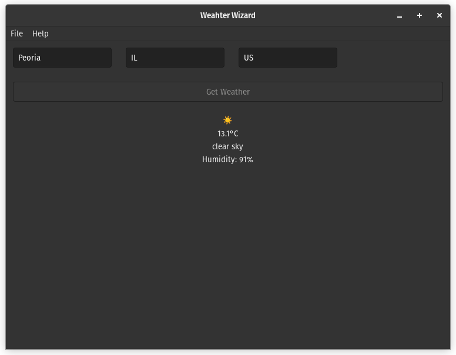

# Open Weather Wizard - A rust weather application

A rust based GTK4 Weather Application which uses Open-weather API with secure API key storage.

## Features

- **Secure API Key Storage**: API keys are stored securely using OS-native credential storage (Keychain on macOS, Credential Manager on Windows, libsecret/gnome-keyring on Linux)
- **Cross-platform**: Works on Windows, macOS, and Linux
- **GTK4 UI**: Modern and responsive user interface
- **Real-time Weather Data**: Fetches current weather information from OpenWeatherMap API

## Setup

### 1. Get an OpenWeatherMap API Key

1. Sign up at [OpenWeatherMap](https://openweathermap.org/api)
2. Generate a free API key

### 2. Configure Your API Key

Use the built-in configuration utility to securely store your API key:

```bash
# Set your API key
cargo run --bin configure-api-key set YOUR_API_KEY_HERE

# Check if API key is configured
cargo run --bin configure-api-key check

# Remove API key (if needed)
cargo run --bin configure-api-key remove
```

### Migration from Hardcoded API Key

If you're upgrading from a previous version that used a hardcoded API key, you'll need to configure your own API key using the steps above. The hardcoded key has been removed for security reasons.

## Development

### Building without GTK dependencies

The secure storage functionality can be tested independently:

```bash
# Test secure storage functionality
cargo test secure_storage
```

### Architecture

- `src/secure_storage.rs` - Secure credential storage using OS-native backends
- `src/weather_api/` - OpenWeatherMap API integration
- `src/ui/` - GTK4 user interface components
- `src/bin/configure-api-key.rs` - Command-line utility for API key management

## UI


