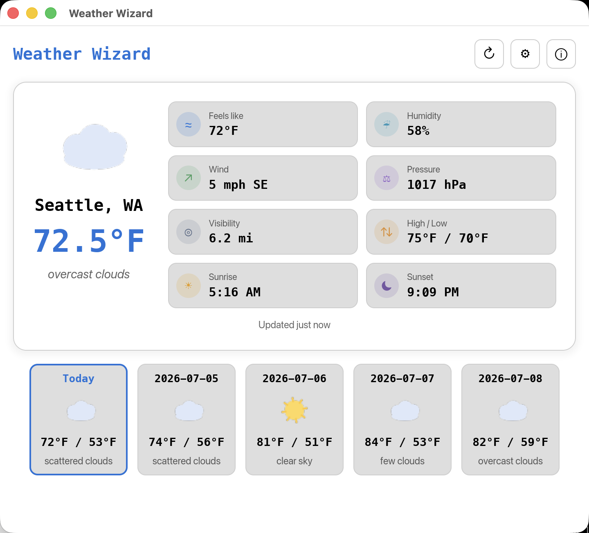

#  Open Weather Wizard

[](https://github.com/arunkumar-mourougappane/open-weather-wizard/actions/workflows/ci.yml)
[](https://crates.io/crates/open-weather-wizard)
[](LICENSE)

A simple, elegant desktop weather app built in Rust with [iced](https://github.com/iced-rs/iced). Current conditions, a 5-day forecast you can tap into for detail, and every weather condition rendered as its own hand-authored, GPU-composited [Lottie](https://lottiefiles.com/) animation.

<p align="center">
  
</p>

## Features

- **Current conditions at a glance** — icon, temperature, and a color-coded stat grid (feels-like, humidity, wind, pressure, visibility, sunrise/sunset).
- **5-day forecast carousel** — centered when it fits, an invisible-scroll carousel when it doesn't. Tap any day to see its full detail (hi/lo, feels-like, humidity, wind, pressure, visibility, chance of rain) right in the main card, no popup or extra window.
- **Animated weather icons for every condition** — sun, rain, snow, clouds, thunderstorms, drizzle, fog, haze, wind, tornado, and more, each a small Lottie composition rendered through [`velato`](https://github.com/linebender/velato) straight onto iced's own `wgpu` surface.
- **Silent, non-blocking refresh** — data updates automatically every 30 seconds (or on demand) without ever blanking the screen back to a spinner; changed values cross-fade in place. A shimmer skeleton placeholder is shown only for the very first load.
- **Dark mode and °C/°F**, both live-previewed in Preferences before you save.
- **Two weather providers** — real data from [OpenWeatherMap](https://openweathermap.org/) (free-tier API key required), or a built-in Google Weather mock provider that needs no key at all, handy for trying the app out.
- **Cross-platform** — Linux, macOS, and Windows, with no system GUI toolkit dependency.

## Technology Stack

- [**Rust**](https://www.rust-lang.org/) — application logic.
- [**iced**](https://github.com/iced-rs/iced) — the GUI, in the Elm-architecture style (state / message / update / view).
- [**velato**](https://github.com/linebender/velato) + [**vello**](https://github.com/linebender/vello) — Lottie-to-GPU animation, sharing iced's own `wgpu` device for direct compositing.
- [**tokio**](https://tokio.rs/) — async weather/forecast fetches.
- [**reqwest**](https://github.com/seanmonstar/reqwest) — HTTP client for the weather APIs.
- [**serde**](https://serde.rs/) — configuration and API response (de)serialization.
- [**rust-embed**](https://github.com/pyrossh/rust-embed) — bundles icons into the binary for offline startup.

See [`docs/ARCHITECTURE.md`](docs/ARCHITECTURE.md) for the module map and design rationale, and [`docs/ICON_MAPPING.md`](docs/ICON_MAPPING.md) for how a weather condition becomes an animated icon.

## Installation

### Prebuilt app packages (recommended)

Each [GitHub Release](https://github.com/arunkumar-mourougappane/open-weather-wizard/releases) includes installable packages alongside raw binaries:

- **macOS** — `.dmg` (drag `Open Weather Wizard.app` into `/Applications`)
- **Linux** — `.deb` (`sudo apt install ./open-weather-wizard_*.deb` or `sudo dpkg -i`)
- **Windows** — `.exe` NSIS installer (Start Menu shortcut, uninstaller)

### From crates.io

```bash
cargo install open-weather-wizard
```

### Quick Install (Linux, from source)

Clones the repo, builds and installs the binary, and sets up desktop integration (application menu entry, icons):

```bash
git clone https://github.com/arunkumar-mourougappane/open-weather-wizard.git
cd open-weather-wizard
./install.sh
```

Uninstall with `open-weather-wizard-uninstall` (installed alongside the binary), or manually:

```bash
cargo uninstall open-weather-wizard
rm -f ~/.local/share/applications/open-weather-wizard.desktop
rm -f ~/.local/share/icons/hicolor/*/apps/open-weather-wizard.*
```

### From Source

```bash
git clone https://github.com/arunkumar-mourougappane/open-weather-wizard.git
cd open-weather-wizard
cargo run          # run without installing
cargo install --path .   # or install the binary
```

#### Linux build dependencies

iced's `wgpu`/`winit` backend needs a few windowing headers to *build* (no GTK or other desktop toolkit required):

```bash
# Debian/Ubuntu
sudo apt-get install libxkbcommon-dev libwayland-dev libx11-dev libxrandr-dev libxi-dev
```

macOS and Windows builds have no extra system dependencies beyond a working Rust toolchain.

## Configuration

On first run, the app creates a config file and starts with sensible defaults. Everything can also be changed from the in-app **Preferences** window (weather provider, API token, location, dark mode, units) — changes there are previewed live before you save.

The config file lives at (via the [`dirs`](https://github.com/dirs-dev/dirs-rs) crate's platform conventions):

| Platform | Path |
|---|---|
| Linux | `~/.config/open-weather-wizard/config.json` |
| macOS | `~/Library/Application Support/open-weather-wizard/config.json` |
| Windows | `%APPDATA%\open-weather-wizard\config.json` |

Delete the file to reset to defaults.

### API Keys

- **OpenWeatherMap**: sign up for a free API key at [openweathermap.org](https://openweathermap.org/api), then paste it into Preferences (or the config file).
- **Google Weather**: a mock provider for development/demo purposes — no key needed, but it returns sample data rather than live conditions and has no forecast.

## Troubleshooting

**Weather data not loading:**

- Check your internet connection and that your OpenWeatherMap API key is valid.
- Run with verbose logging to see request/response details: `RUST_LOG=debug cargo run`.

**Reset configuration:**

- Delete the config file at the path listed above and restart the app.

## Contributing

Contributions are welcome! If you have a feature request, bug report, or want to contribute to the code, please feel free to open an issue or a pull request.

## License

This project is licensed under the MIT License — see the [LICENSE](LICENSE) file for details.
